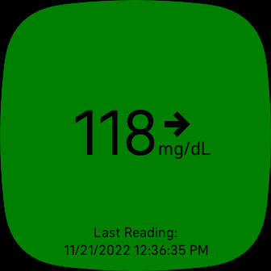

<!--
 Copyright 2022 Sam Steele
 
 Licensed under the Apache License, Version 2.0 (the "License");
 you may not use this file except in compliance with the License.
 You may obtain a copy of the License at
 
     http://www.apache.org/licenses/LICENSE-2.0
 
 Unless required by applicable law or agreed to in writing, software
 distributed under the License is distributed on an "AS IS" BASIS,
 WITHOUT WARRANTIES OR CONDITIONS OF ANY KIND, either express or implied.
 See the License for the specific language governing permissions and
 limitations under the License.
-->

# Fitbit-LibreLinkUp

Display latest glucose reading from Freestyle Libre sensors via LibreLinkUp on a Fitbit OS 5.0 device (Sense, Versa 3)



## Install

Connect your phone and your watch to the Fitbit developer bridge, then execute the following shell commands to build and side-load the app:

```shell
npm add @fitbit/sdk
npm add @fitbit/sdk-cli
npx fitbit-build generate-appid
npx fitbit-build
npx fitbit
fitbit$ connect phone
fitbit$ install
```

For more information on how to use the Fitbit developer bridge, see Fitbit's documentation: [https://dev.fitbit.com/getting-started/](https://dev.fitbit.com/getting-started/)

## Usage

Open the Freestyle Libre app and tap "Connected Apps" from the menu, then send yourself an invitation to view your data via LibreLinkUp.  Install the LibreLinkUp app on your phone, login, and accept the invitation.

Launch the Fitbit app on your phone and open the settings page for this app. Enter your Freestyle LibreLinkUp email address and password, then tap the login button.

You may need to modify the `LIBRELINKUP_URL` variable in `companion/index.ts` if you're using the servers in a different region.

## License

Copyright (C) 2022 Sam Steele. Licensed under the Apache License, Version 2.0 (the "License"); you may not use this file except in compliance with the License. You may obtain a copy of the License at

http://www.apache.org/licenses/LICENSE-2.0

Unless required by applicable law or agreed to in writing, software distributed under the License is distributed on an "AS IS" BASIS, WITHOUT WARRANTIES OR CONDITIONS OF ANY KIND, either express or implied. See the License for the specific language governing permissions and limitations under the License.