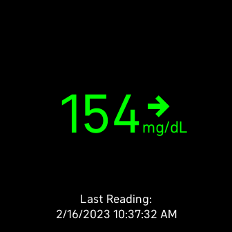

<!--
 Copyright 2022 Sam Steele
 
 Licensed under the Apache License, Version 2.0 (the "License");
 you may not use this file except in compliance with the License.
 You may obtain a copy of the License at
 
     http://www.apache.org/licenses/LICENSE-2.0
 
 Unless required by applicable law or agreed to in writing, software
 distributed under the License is distributed on an "AS IS" BASIS,
 WITHOUT WARRANTIES OR CONDITIONS OF ANY KIND, either express or implied.
 See the License for the specific language governing permissions and
 limitations under the License.
-->

# Fitbit-LibreLinkUp

Display latest glucose reading from Freestyle LibreLinkUp on a Fitbit OS 5.0 device (Sense, Versa 3)



## Install
Using Fitbit developer bridge:

```shell
npm add @fitbit/sdk
npm add @fitbit/sdk-cli
npx fitbit-build generate-appid
npx fitbit-build
npx fitbit
fitbit$ connect phone
fitbit$ install
```

## Usage

Launch the Fitbit app on your phone and open the settings page for this app. Enter your Freestyle LibreLinkUp email address and password, then tap the login button.

You may need to modify the `LIBRELINKUP_URL` variable in `companion/index.ts` if you're using the servers in a different region.

## License

Copyright (C) 2022 Sam Steele. Licensed under the Apache License, Version 2.0 (the "License"); you may not use this file except in compliance with the License. You may obtain a copy of the License at

http://www.apache.org/licenses/LICENSE-2.0

Unless required by applicable law or agreed to in writing, software distributed under the License is distributed on an "AS IS" BASIS, WITHOUT WARRANTIES OR CONDITIONS OF ANY KIND, either express or implied. See the License for the specific language governing permissions and limitations under the License.